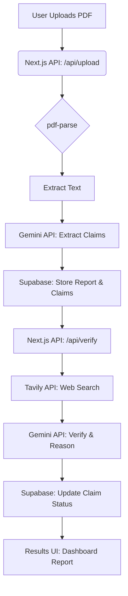

# Veritas AI - Premium Fact Check Agent

A production-ready AI-powered fact-checking platform built with Next.js 15, Gemini 1.5 Flash, Tavily, and Supabase.


## 🚀 Features

1. **PDF Parsing**: Upload documents and instantly extract text using `pdf-parse`.
2. **Claim Extraction**: Gemini AI parses text and extracts verifiable claims (dates, financial, technical, etc.).
3. **Automated Verification**: Uses the Tavily API to search the web and cross-reference claims against trusted sources.
4. **AI Reasoning**: Gemini AI analyzes search results and scores claims as *Verified, Inaccurate, False, or Misleading*.
5. **Premium UI**: Designed with Tailwind CSS, Framer Motion, and shadcn/ui for a luxury, modern SaaS feel.

## 🏗 Architecture Diagram



## 🛠 Tech Stack

- **Frontend**: Next.js 15 App Router, React, TypeScript
- **Styling**: Tailwind CSS, Framer Motion, shadcn/ui
- **Database**: Supabase PostgreSQL, Supabase Auth
- **AI**: Google Gemini 1.5 Flash API
- **Search**: Tavily API
- **PDF Parsing**: `pdf-parse`
- **Deployment**: Vercel

## ⚙️ Environment Setup

Create a `.env.local` file with the following variables:

```env
NEXT_PUBLIC_SUPABASE_URL=your_supabase_url
NEXT_PUBLIC_SUPABASE_ANON_KEY=your_supabase_anon_key
GEMINI_API_KEY=your_gemini_api_key
TAVILY_API_KEY=your_tavily_api_key
```

## 📜 Development Phases & Git Commits

1. **Phase 1**: Setup Next.js, Tailwind, and shadcn (`git commit -m "Phase 1: Setup..."`)
2. **Phase 2**: Setup Supabase, auth clients, and database schema (`git commit -m "Phase 2: Setup..."`)
3. **Phase 3**: Build upload UI and premium dashboard layout (`git commit -m "Phase 3: Build..."`)
4. **Phase 4**: Implement PDF extraction and claim extraction using Gemini (`git commit -m "Phase 4: Implement..."`)
5. **Phase 5**: Implement verification engine using Tavily and Gemini (`git commit -m "Phase 5: Implement..."`)
6. **Phase 6**: Build results page UI for report verification (`git commit -m "Phase 6: Build..."`)

## 🚢 Deployment on Vercel

1. Push your code to a GitHub repository.
2. Go to [Vercel](https://vercel.com/) and click **Add New Project**.
3. Import your GitHub repository.
4. Add the Environment Variables (`NEXT_PUBLIC_SUPABASE_URL`, `NEXT_PUBLIC_SUPABASE_ANON_KEY`, `GEMINI_API_KEY`, `TAVILY_API_KEY`).
5. Click **Deploy**. Vercel will automatically build and deploy your Next.js application.

## 📸 Screenshots

*(Add screenshots of your UI here. E.g., The futuristic upload dashboard, the verification process, and the detailed report page with confidence scores.)*
